# Implementation-of-Logistic-Regression-Model-to-Predict-the-Placement-Status-of-Student

## AIM:
To write a program to implement the the Logistic Regression Model to Predict the Placement Status of Student.

## Equipments Required:
1. Hardware – PCs
2. Anaconda – Python 3.7 Installation / Jupyter notebook

## Algorithm
1. Import the standard libraries.

2. Upload the dataset and check for any null or duplicated values using .isnull() and .duplicated() function respectively.

3. Import LabelEncoder and encode the dataset.

4. Import LogisticRegression from sklearn and apply the model on the dataset.

5. Predict the values of array.

6. Calculate the accuracy, confusion and classification report by importing the required modules from sklearn.

7. Apply new unknown values

## Program:
### Program to implement the the Logistic Regression Model to Predict the Placement Status of Student.
```py
# Developed by: YUVARAJ.S
# RegisterNumber: 22008589 
# Import Library
import pandas as pd
import numpy as np
import matplotlib.pyplot as plt
#Read The File
dataset=pd.read_csv('Placement_Data_Full_Class.csv')
dataset
dataset.head(10)
dataset.tail(10)
# Dropping the serial number and salary column
dataset=dataset.drop(['sl_no','ssc_p','workex','ssc_b'],axis=1)
dataset
dataset.shape
dataset.info()
dataset["gender"]=dataset["gender"].astype('category')
dataset["hsc_b"]=dataset["hsc_b"].astype('category')
dataset["hsc_s"]=dataset["hsc_s"].astype('category')
dataset["degree_t"]=dataset["degree_t"].astype('category')
dataset["specialisation"]=dataset["specialisation"].astype('category')
dataset["status"]=dataset["status"].astype('category')
dataset.info()
dataset["gender"]=dataset["gender"].cat.codes
dataset["hsc_b"]=dataset["hsc_b"].cat.codes
dataset["hsc_s"]=dataset["hsc_s"].cat.codes
dataset["degree_t"]=dataset["degree_t"].cat.codes
dataset["specialisation"]=dataset["specialisation"].cat.codes
dataset["status"]=dataset["status"].cat.codes
dataset.info()
dataset
# selecting the features and labels
x=dataset.iloc[:, :-1].values
y=dataset.iloc[: ,-1].values
y
# dividing the data into train and test
from sklearn.model_selection import train_test_split
x_train,x_test,y_train,y_test=train_test_split(x,y,test_size=0.2)
dataset.head()
y_train.shape
x_train.shape
# Creating a Classifier using Sklearn
from sklearn.linear_model import LogisticRegression
clf=LogisticRegression(random_state=0,solver='lbfgs',max_iter=1000).fit(x_train,y_train)
# Printing the acc
clf=LogisticRegression()
clf.fit(x_train,y_train)
clf.score(x_test,y_test)
# Predicting for random value
clf.predict([[1	,78.33,	1,	2,	77.48,	2,	86.5,	0,	66.28]])
```

## Output:
### Read CSV File:
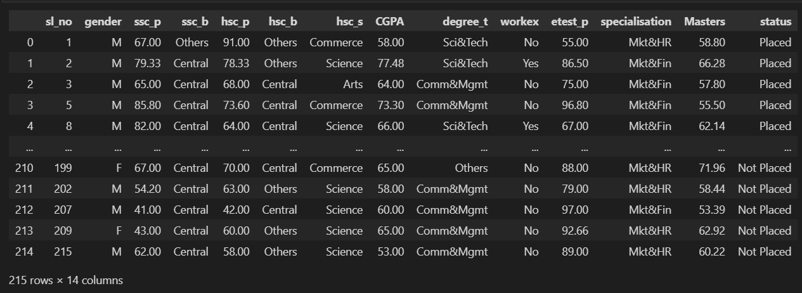
### To read 1st ten Data(Head):
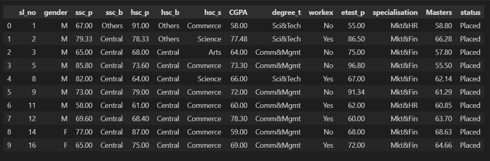
### To read last ten Data(Tail):
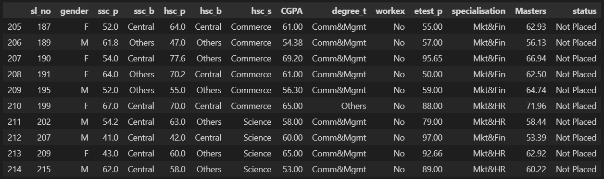
### Dropping the serial number and salary column:
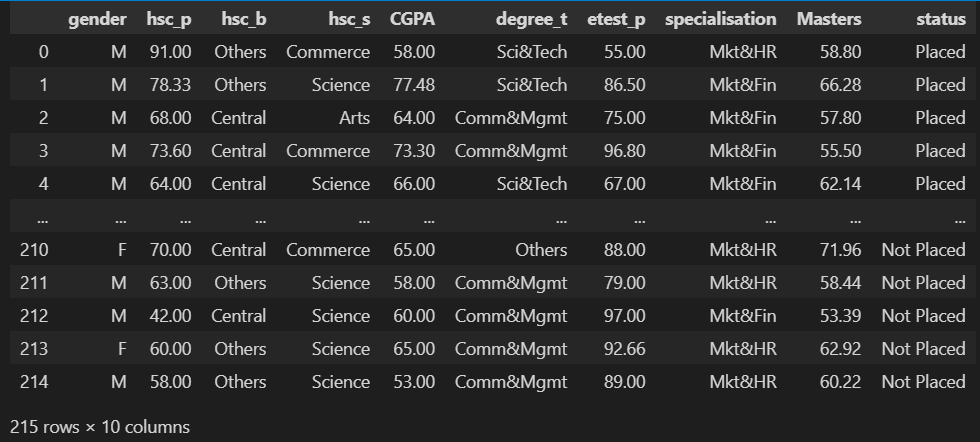
### Dataset Shape:
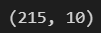
### Dataset Information:
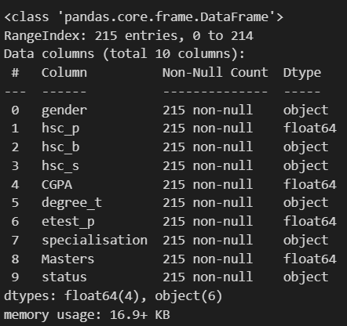
### Dataset after changing object into category:
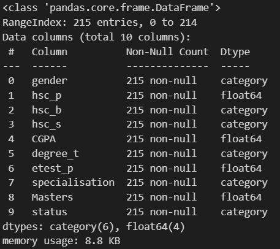
### Dataset after changing category into integer:
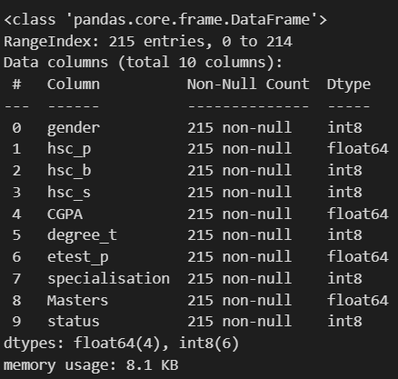
### Displaying the Dataset:
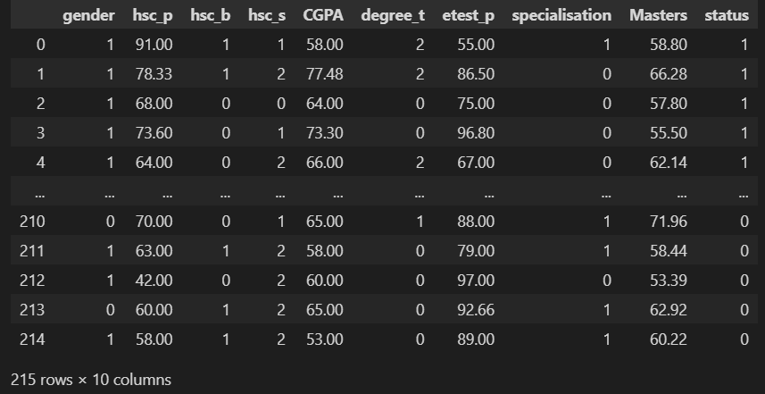
### Selecting the features and labels:
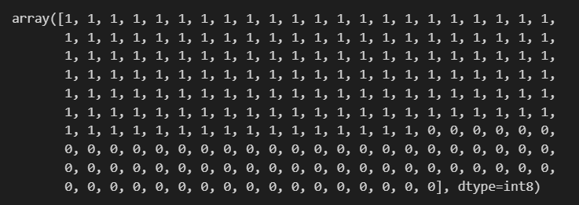
### Dividing the data into train and test:
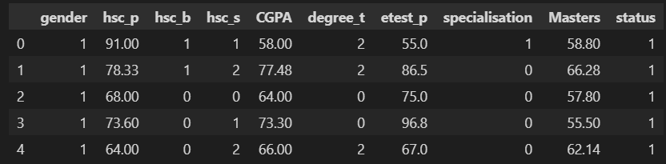
### Shape of x_train and y_train:
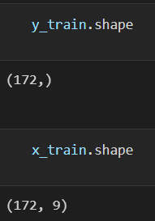
### Creating a Classifier using Sklearn:
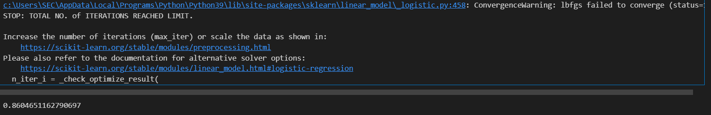
### Predicting for random value:
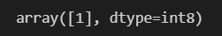
## Result:
Thus the program to implement the the Logistic Regression Model to Predict the Placement Status of Student is written and verified using python programming.
